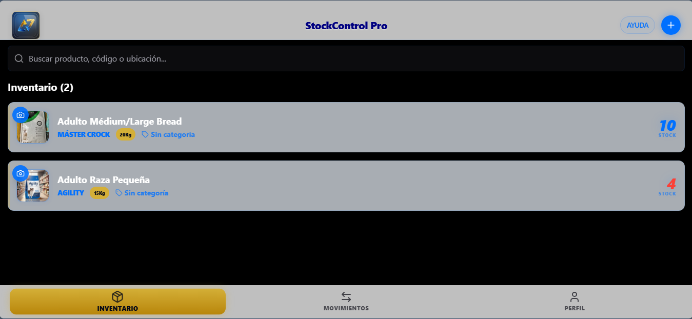
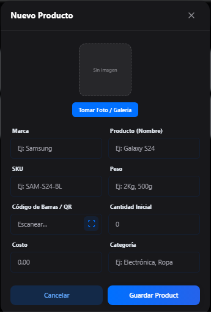

StockControl Pro — Intelligent Inventory Management System 📱📦

📋 Descripción Ejecutiva

StockControl Pro es una solución diseñada para resolver problemas operativos en la cadena de suministro de PyMEs y grandes comercios. Desarrollado por **UniverseAI**, la firma consultora de IA que diseñó la arquitectura, para **LexinCorp** (titular de la propiedad intelectual), el sistema trasciende el simple registro de datos, convirtiéndose en un asistente inteligente para la toma de decisiones estratégicas.

 

  

 

🚀 Innovación y Características Core
Experiencia Nativa en Mobile & Desktop: Optimización "Mobile-First" con estética estilo iOS, permitiendo una transición fluida entre dispositivos.

Escaneo Inteligente: Escaneo de código de barras opcional (Fix de DROP NOT NULL).

 

  

 

Arquitectura Real-time & Offline-First: Sincronización instantánea mediante Supabase y operatividad total sin conexión a internet gracias a una implementación avanzada de Service Workers (PWA).

 

  

 

Módulo de Inteligencia Operativa:

Dashboard: Dashboard con filtrado dinámico por categorías y panel de stock crítico inteligente (Top 3).

Reportería Ejecutiva: Generación de reportes PDF reales con la librería jspdf.
🛠️ Ingeniería de Software y Seguridad
El proyecto ha sido construido bajo estándares rigurosos de ingeniería para garantizar la escalabilidad:

Backend as a Service (BaaS): Implementación de Supabase para una gestión de datos relacional robusta y segura.

Seguridad y Autenticación: Control de acceso granular mediante Supabase Auth, asegurando que los datos críticos de la empresa estén protegidos bajo protocolos de encriptación estándar.

Frontend Performance: Utilización de Vite y Tailwind CSS para lograr tiempos de carga ínfimos y una interfaz altamente responsiva.

🛡️ Nota sobre Propiedad Intelectual
Este repositorio funciona como un Showcase Técnico. Debido a que StockControl Pro es un producto con fines comerciales y propiedad intelectual protegida de LexinCorp, el código fuente completo se mantiene en un repositorio privado.

Para Reclutadores y Partners: Si desea realizar una revisión de código profunda para procesos de selección o discutir una demo comercial, por favor contácteme directamente para solicitar acceso temporal al repositorio privado.

"Este proyecto nació de la necesidad de digitalizar comercios locales en Córdoba, transformando procesos manuales en una experiencia móvil fluida y eficiente."

⚡ Stack Tecnológico

- **Frontend**:   
- **Backend**:  (PostgreSQL & Auth)
- **Librerías**: jspdf, Lucide React, React Router

🔄 Mantenimiento y Próximos Pasos

- Implementación de notificaciones push para alertas de stock.
- Integración con el API de WhatsApp para envío de reportes.

✉️ Contacto
Sebastian (Seba) Reynoso > Lead Fullstack Developer & Founder at UniverseAI. 

📍 Córdoba, Argentina

📧 Andalexreynoso@gmail.com

🔗 LinkedIn / Mi Portfolio Personal

Desarrollado con pasión por la tecnología.
