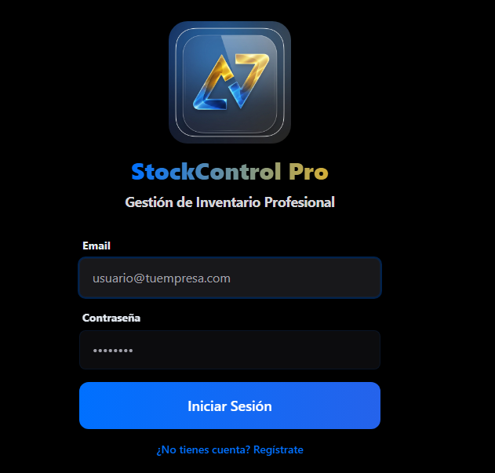

StockControl Pro — Intelligent Inventory Management System 📱📦

📋 Descripción Ejecutiva
StockControl Pro es una solución de grado empresarial diseñada para resolver la ineficiencia operativa en la cadena de suministro de PyMEs y grandes comercios. Desarrollado bajo la visión de UniverseAI para LexinCorp, el sistema trasciende el simple registro de datos, convirtiéndose en un asistente inteligente para la toma de decisiones estratégicas.

🚀 Innovación y Características Core
Experiencia Nativa en Mobile & Desktop: Optimización "Mobile-First" con estética estilo iOS, permitiendo una transición fluida entre dispositivos.

Escaneo Inteligente: Integración nativa con la cámara del dispositivo para lectura de códigos de barras y QR en tiempo real, eliminando el error humano en la carga.

Arquitectura Real-time & Offline-First: Sincronización instantánea mediante Supabase y operatividad total sin conexión a internet gracias a una implementación avanzada de Service Workers (PWA).
  

Módulo de Inteligencia Operativa (En Desarrollo):

Alertas Críticas: Notificaciones automáticas por email y visualización en rojo para niveles de inventario por debajo del umbral de seguridad.

Reportería Ejecutiva: Generación dinámica de reportes en PDF para auditorías y control contable.

🛠️ Ingeniería de Software y Seguridad
El proyecto ha sido construido bajo estándares rigurosos de ingeniería para garantizar la escalabilidad:

Backend as a Service (BaaS): Implementación de Supabase para una gestión de datos relacional robusta y segura.

Seguridad y Autenticación: Control de acceso granular mediante Supabase Auth, asegurando que los datos críticos de la empresa estén protegidos bajo protocolos de encriptación estándar.

Frontend Performance: Utilización de Vite y Tailwind CSS para lograr tiempos de carga ínfimos y una interfaz altamente responsiva.

🛡️ Nota sobre Propiedad Intelectual
Este repositorio funciona como un Showcase Técnico. Debido a que StockControl Pro es un producto con fines comerciales y propiedad intelectual protegida de LexinCorp, el código fuente completo se mantiene en un repositorio privado.

Para Reclutadores y Partners: Si desea realizar una revisión de código profunda para procesos de selección o discutir una demo comercial, por favor contácteme directamente para solicitar acceso temporal al repositorio privado.

✉️ Contacto
Sebastian (Seba) Reynoso CEO & Fullstack Developer en UniverseAI 📍 Córdoba, Argentina

📧 Andalexreynoso@gmail.com

🔗 LinkedIn / Mi Portfolio Personal

Desarrollado con pasión por la tecnología y la eficiencia empresarial.
