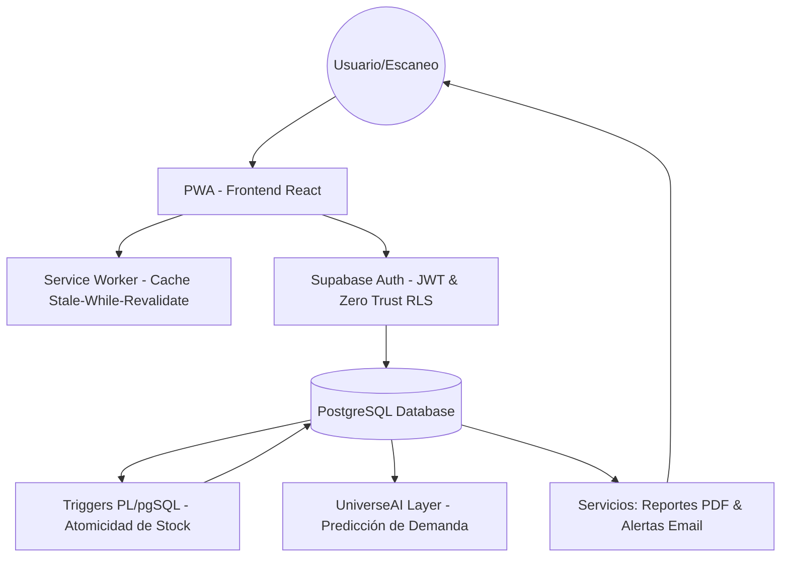

Arquitectura de Software — StockControl Pro 📱📦

🏗️ Introducción

StockControl Pro ha sido diseñado bajo una arquitectura Offline-First y Real-time, priorizando la alta disponibilidad de los datos y la fluidez de la experiencia de usuario en entornos industriales y comerciales exigentes. El sistema utiliza un stack moderno liderado por Supabase como Backend-as-a-Service (BaaS) y una lógica de Progressive Web App (PWA) para garantizar la operatividad continua, incluso en condiciones de conectividad nula.

📊 Diagrama de Sistema (Arquitectura de Flujo)
Este diagrama describe la interacción entre la capa de cliente, la persistencia de datos y los servicios inteligentes de UniverseAI.

💾 Persistencia y Seguridad (Supabase)
La gestión de datos se realiza mediante una arquitectura relacional en PostgreSQL, optimizada con políticas de seguridad de Confianza Cero (Zero Trust).

**Sincronización de Base de Datos (Esquema Actual)**
El esquema de base de datos refleja la realidad operativa en Supabase:
- **Tabla `productos`**: Contiene la definición de los artículos del inventario. La columna `categoria` es **obligatoria** (`NOT NULL`), asegurando un filtrado y organización coherente en el dashboard.
- **Tabla `movimientos`**: Registra las entradas y salidas de stock. La columna de fecha se denomina **`created_at`** (no timestamp), garantizando precisión inmutable en la auditoría de cada transacción.

Estrategia de Seguridad:
Row Level Security (RLS): Implementamos políticas granulares donde el acceso a los datos está vinculado estrictamente al usuario_id del JWT, evitando cualquier riesgo de escalada de privilegios.

Integridad Atómica: Utilizamos Procedimientos Almacenados (PL/pgSQL) disparados por TRIGGERS. Esto garantiza que la actualización del stock sea una operación atómica en el servidor, eliminando discrepancias de datos causadas por la lógica del frontend.

🧠 Intelligence Layer (UniverseAI)
Como parte de la propuesta de valor de UniverseAI, el sistema integra una capa de análisis avanzado:

Motor Predictivo: Integración con modelos LLM para el análisis de tendencias de ventas históricas.

Alertas Inteligentes: Sistema proactivo que identifica niveles críticos de inventario y genera notificaciones transaccionales vía email antes de que ocurra una ruptura de stock.

Reporting Ejecutivo: Generación bajo demanda de reportes en formato PDF para auditorías físicas y contables.

🌐 Lógica PWA y Resiliencia Offline
Para lograr la visión de una aplicación nativa en la web, StockControl Pro implementa estrategias avanzadas de Workbox:

Caching Estratégico: Utilizamos Stale-While-Revalidate para recursos críticos, permitiendo cargas instantáneas.

Sincronización Proactiva: El sistema detecta automáticamente nuevas versiones de la lógica de negocio, permitiendo actualizaciones en caliente sin interrumpir la sesión del usuario.

Escaneo Nativo: Integración directa con hardware de cámara para la decodificación de códigos de barras/QR con latencia mínima.

🛠️ Stack Tecnológico
Frontend: React + Vite (Optimización de bundle ultra-rápida).

Estilos: Tailwind CSS (Diseño atómico basado en componentes estilo iOS).

Backend & Auth: Supabase (PostgreSQL, Real-time Engine).

PWA: Vite PWA Plugin + Workbox.

Servicios Externos: Resend/Nodemailer para alertas y jspdf para la capa de reportes.

Propiedad Intelectual
LexinCorp es el **titular de la propiedad intelectual** de StockControl Pro.
Arquitectura diseñada por **UniverseAI**, la firma consultora de IA.

🌐 sebastianreynoso.dev